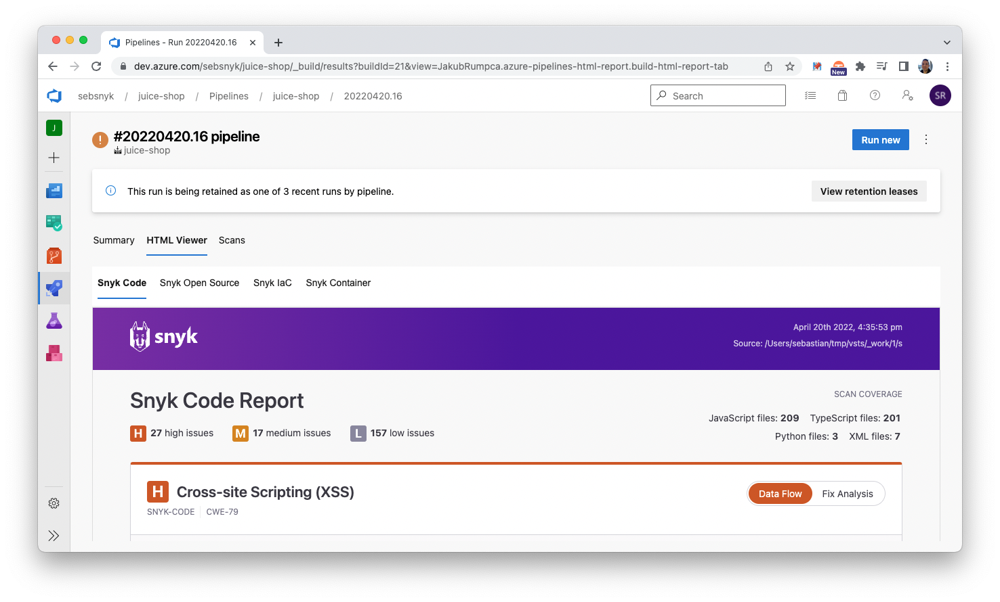

# Azure Pipelines

Running Snyk in a Azure Pipeline can be achieved by installing snyk manually or using the [extension](https://marketplace.visualstudio.com/items?itemName=Snyk.snyk-security-scan). At time of writing only **Open Source** and **Container** scans are available the extension.

## Inline display of [SARIF data](https://github.com/microsoft/sarif-tutorials/blob/main/docs/1-Introduction.md#:~:text=SARIF%2C%20the%20Static%20Analysis%20Results,for%20use%20by%20simpler%20tools.)

Azure pipelines support the inline display of scan results via a [plugin][sarif-viewer-plugin]. 

See [AzurePipelines-npm-generic-sarif.yml](AzurePipelines-npm-generic-sarif.yml) for instructions how to get this output.

## HTML reports

You can also use `snyk-to-html` to create HTML artifacts. They can be browsed using a [plugin][html-viewer-plugin] or downloaded from the pipeline.

The HTML reports are also available for download directly from the pipeline page ("Related"):

See [AzurePipelines-npm-generic-html.yml](AzurePipelines-npm-generic-html.yml) for instructions how to get this output.

[sarif-viewer-plugin]: https://marketplace.visualstudio.com/items?itemName=sariftools.scans&targetId=bf3858e2-f2d0-4e06-962a-2107402a1234
[html-viewer-plugin]: https://marketplace.visualstudio.com/items?itemName=JakubRumpca.azure-pipelines-html-report

## Installing Azure Extension & configuring the service connection

1. Install the [extension](https://marketplace.visualstudio.com/items?itemName=Snyk.snyk-security-scan) into your Azure DevOps environment.
2. Configure a service connection endpoint with your Snyk token. This is done at the project level. In Azure DevOps, go to Project settings -> Service connections -> New service connection -> Snyk Authentication. Give your service connection and enter a valid Snyk Token.
3. Within an Azure DevOps Pipeline, add the Snyk Security Scan task and configure it according to your needs according to details and examples below.

See [AzurePipelines-plugin-generic-sarif.yml](AzurePipelines-plugin-generic-sarif.yml) for an example on how to use the extension.
